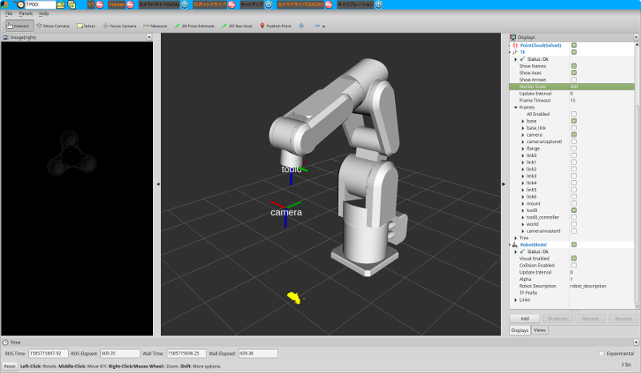

# MELFA 3D表示

## アップデート  
以下のReposをアップデートします

- rovi_visual_teach(develブランチ)
- rovi_industrial(develブランチ)

## インストール  
3Dモデルは[YOODS/melfa..](https://github.com/YOODS/melfa_robot)にあります。catkin_ws/srcにて以下を実行します。
~~~
git clone https://github.com/YOODS/melfa_robot.git
~~~

## ロボットコントローラの設定  
以下のパラメータを書き換えます。

|パラメータ名|値|説明|
|:----|:----|:----|
|MONMODE|1|モニター機能有効|
|MONPORT|12000,12001|モニター機能が使用するポート番号|

## 設定ファイルの編集　
rovi_visual_teach/rc.d/melfa.yamlを環境に合せて編集します。
~~~
config:
  dashboard:
    launch_vga:
      file: ycam3vga.launch
    launch_sxga:
      file: ycam3sxga.launch
    launch_rsock:
      file: melfa_rv4fl.launch
  rsocket:
    port: 10002
    update_frame_id: tool0_controller
    robot_ip: 192.168.221.239        #パラメータNETIPに合わせる
    robot_port: [12000,12001]        #パラメータMONPORTに合わせる

config_tf:
  mount:
    parent_frame_id: tool0
  base:
    parent_frame_id: world
~~~

## スクリーンショット　
RvizのDisplayパネルにて、Add▶RobotModelを選びます。  

- 以下のように、ロボットモデルが表示されます。
- TF▶Frames▶**camera**がロボットに対して正しい位置に表示されているか確認します。
 

